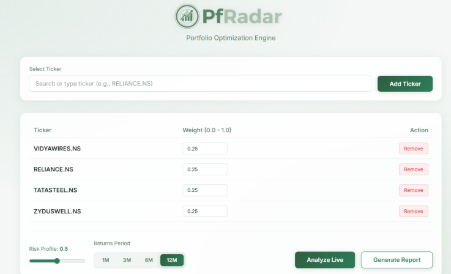
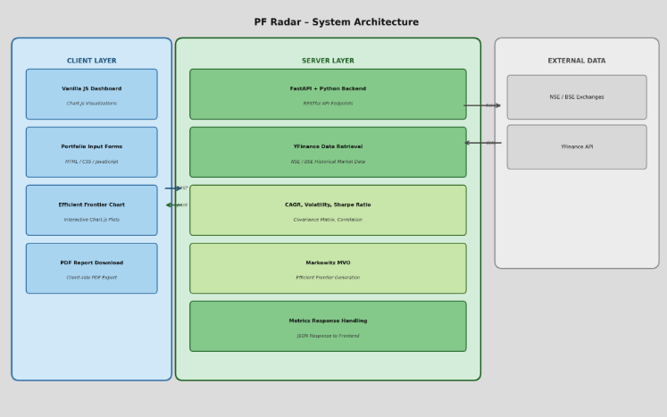
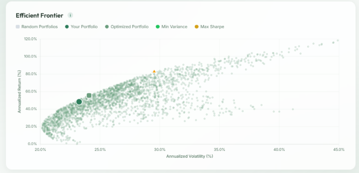
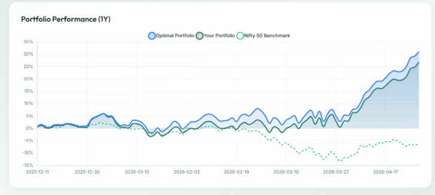

# PfRadar

Portfolio analytics and optimization project focused on Indian equities (NSE/BSE).

## Overview

PfRadar is a portfolio analytics platform that helps investors build optimized portfolios for Indian equities.

The application fetches real-time NSE/BSE stock data, calculates portfolio risk and expected return, applies Modern Portfolio Theory and CAPM, and generates visual analytics together with downloadable PDF reports.
## 📸 Screenshots

### Dashboard

<p align="center">
  
</p>

The main interface allows users to add NSE/BSE stocks, assign portfolio weights, and generate optimized portfolio analytics.

---

### System Architecture

<p align="center">
  
</p>

The application uses a modular architecture where the frontend communicates with a Python analytics engine responsible for market data retrieval, portfolio optimization, CAPM calculations, and report generation.

---

### Efficient Frontier

<p align="center">
  
</p>

Visualization of randomly generated portfolios highlighting the Efficient Frontier, Maximum Sharpe Ratio portfolio, and Minimum Volatility portfolio.

---

### Portfolio Performance

<p align="center">
  
</p>

Comparison of portfolio growth against benchmark indices over the selected investment period.
## Tech stack


- Python
- pandas, numpy, scipy
- yfinance
- matplotlib
- pydantic
- pytest

## Folder structure

```text
PfRadar/
├─ README.md
├─ .gitignore
└─ engine/
   ├─ README.md
   ├─ requirements.txt
   ├─ main.py
   ├─ pytest.ini
   ├─ conftest.py
   ├─ data/
   │  └─ .gitkeep
   ├─ models/
   │  ├─ __init__.py
   │  ├─ constants.py
   │  ├─ exceptions.py
   │  └─ schemas.py
   ├─ services/
   │  ├─ __init__.py
   │  ├─ market_data.py
   │  ├─ optimizer.py
   │  ├─ frontier.py
   │  ├─ report.py
   │  └─ capm.py
   ├─ utils/
   │  ├─ __init__.py
   │  ├─ logging_config.py
   │  ├─ returns.py
   │  ├─ risk.py
   │  └─ visualization.py
   └─ tests/
      ├─ __init__.py
      ├─ test_returns.py
      ├─ test_risk.py
      ├─ test_optimizer.py
      └─ test_integration_nse.py
```

## Quick start

```bash
cd engine
python -m venv .venv
.\.venv\Scripts\activate
pip install -r requirements.txt
python main.py demo RELIANCE.NS TCS.NS INFY.NS --plot frontier.png
```

## Testing

```bash
cd engine
pytest -m "not integration"
pytest -m integration
```

For engine-specific details, see [`engine/README.md`](engine/README.md).
